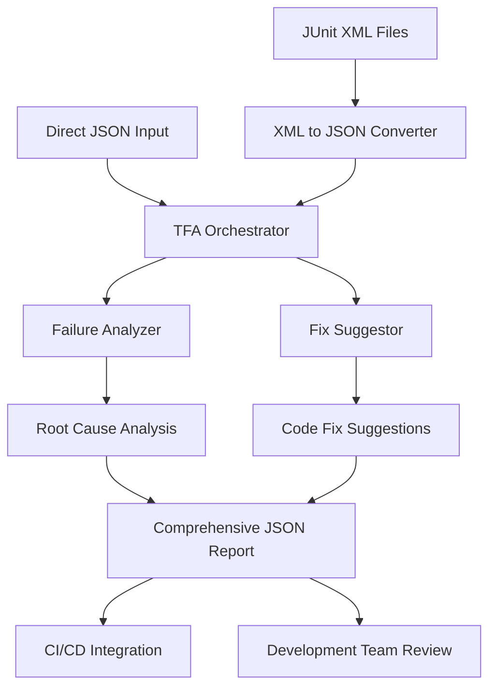

# Test Failure Analysis (TFA) Framework - User Guide

## 📋 Table of Contents

1. [Overview](#overview)
2. [Quick Start](#quick-start)
3. [Installation & Setup](#installation--setup)
4. [Complete Workflow](#complete-workflow)
5. [Usage Examples](#usage-examples)
6. [Input/Output Formats](#inputoutput-formats)
7. [Advanced Configuration](#advanced-configuration)
8. [Integration Examples](#integration-examples)
9. [Troubleshooting](#troubleshooting)
10. [API Reference](#api-reference)
11. [Performance & Scalability](#performance--scalability)

## 🎯 Overview

The Test Failure Analysis (TFA) Framework is a comprehensive Python-based system that automatically analyzes test failures and generates actionable fix suggestions using Claude AI. It's designed to help development teams quickly understand, categorize, and resolve test failures across different testing frameworks.

### Key Features

- **🔍 Intelligent Analysis**: Uses Claude AI to identify root causes of test failures
- **🛠️ Fix Suggestions**: Generates specific, actionable code fixes with priority and effort estimates
- **⚡ Parallel Processing**: Handles multiple test failures simultaneously for faster analysis
- **📊 Comprehensive Reporting**: Produces detailed JSON reports with statistics and insights
- **🔄 Multi-Framework Support**: Works with pytest, Cypress, Jest, JUnit, and more
- **🚀 CI/CD Ready**: Easy integration into existing development workflows

### Who Should Use This

- **Development Teams**: Quick understanding of test failures during sprints
- **QA Engineers**: Root cause analysis and test improvement strategies
- **DevOps Teams**: Automated failure analysis in CI/CD pipelines
- **Technical Leads**: Failure trend analysis and resource planning

## 🚀 Quick Start

### 1. Prerequisites Check

```bash
# Check if Claude CLI is available
which claude

# If not available, install Claude CLI first
# Follow: https://claude.ai/cli-setup
```

### 2. Simple Usage

```bash
# Create sample test failures (for demo)
python analyze_and_suggest_fixes.py --sample

# Analyze the sample failures
python analyze_and_suggest_fixes.py sample_test_failures.json

# View the results
cat comprehensive_analysis.json | jq '.statistics'
```

### 3. Expected Output

```bash
🚀 Comprehensive Test Failure Analysis
📁 Input: sample_test_failures.json
============================================================
📖 Found 4 test cases
🔍 Found 3 failed tests

📊 Step 1: Analyzing 3 failures...
🚀 Processing 3 analyses in parallel (max 3 workers)
✅ 1/3 - test_user_authentication: Analyzed (confidence: 0.85)
✅ 2/3 - test_database_connection: Analyzed (confidence: 0.92)
✅ 3/3 - test_cypress_element_timeout: Analyzed (confidence: 0.78)

🔧 Step 2: Generating fix suggestions...
🚀 Generating 3 fix suggestions in parallel (max 3 workers)
✅ 1/3 - test_user_authentication: Fix generated (Type: quick_fix, Priority: high)
✅ 2/3 - test_database_connection: Fix generated (Type: configuration, Priority: critical)
✅ 3/3 - test_cypress_element_timeout: Fix generated (Type: test_update, Priority: medium)

📁 Comprehensive analysis saved to: comprehensive_analysis.json

✅ Processing Complete!
📊 Statistics:
  Processing time: 42.3s
  Total processed: 3
  Successful analyses: 3
  Analysis success rate: 1.0
  Average confidence: 0.85
  Successful fixes: 3
  Fix success rate: 1.0
  Output file: comprehensive_analysis.json
```

## 🔧 Installation & Setup

### System Requirements

- **Python**: 3.8 or higher
- **Claude CLI**: Latest version
- **Operating System**: macOS, Linux, or Windows
- **Memory**: 2GB+ available RAM
- **Network**: Internet connection for Claude AI API

### Step 1: Install Dependencies

```bash
# Create virtual environment (recommended)
python -m venv tfa-env
source tfa-env/bin/activate  # On Windows: tfa-env\Scripts\activate

# Install Python dependencies
pip install -r requirements.txt
```

### Step 2: Install and Configure Claude CLI

```bash
# Install Claude CLI (if not already installed)
# Follow official Claude CLI installation guide

# Verify installation
claude --version

# Configure authentication
claude auth
```

### Step 3: Verify Setup

```bash
# Test the framework with sample data
cd tfa/claude/analyze_and_fix/
python analyze_and_suggest_fixes.py --sample
python analyze_and_suggest_fixes.py sample_test_failures.json --analysis-only
```

### Step 4: Project Structure

```
tfa/claude/analyze_and_fix/
├── analyze_and_suggest_fixes.py    # Main orchestrator script
├── analyze_failures.py             # Failure analysis component
├── fix_suggestor.py                # Fix suggestion component
├── junit_xml_to_json.py           # JUnit XML converter
├── junit_to_json.py               # Simple XML converter
├── requirements.txt               # Python dependencies
├── README.md                      # Technical documentation
├── TFA_USER_GUIDE.md             # This user guide
└── junit_xml_files/              # Sample XML files directory
```

## 🔄 Complete Workflow

### Input Sources → Processing → Output



### Workflow Steps

#### Step 1: Data Preparation

**Option A: From JUnit XML**
```bash
# Convert XML test results to JSON
python junit_xml_to_json.py test-results.xml --framework cypress --output failed_tests.json
```

**Option B: Direct JSON Input**
```bash
# Use existing JSON file with failed tests
# (See Input Formats section for structure)
```

#### Step 2: Analysis and Fix Generation

```bash
# Full analysis with fix suggestions
python analyze_and_suggest_fixes.py failed_tests.json --output analysis_report.json

# Analysis only (faster, no fixes)
python analyze_and_suggest_fixes.py failed_tests.json --analysis-only

# Custom configuration
python analyze_and_suggest_fixes.py failed_tests.json \
  --max-workers 5 \
  --timeout 180 \
  --max-failures 10 \
  --framework pytest
```

#### Step 3: Review Results

```bash
# View summary statistics
cat analysis_report.json | jq '.statistics'

# View specific test analysis
cat analysis_report.json | jq '.test_results[0].analysis'

# View fix suggestions
cat analysis_report.json | jq '.test_results[0].fix_suggestion'
```

## 📝 Usage Examples

### Example 1: Daily Development Workflow

**Scenario**: Developer wants to quickly analyze CI failures

```bash
# Download test results from CI
curl -o ci_failures.xml "https://ci.company.com/build/123/junit.xml"

# Convert to JSON
python junit_xml_to_json.py ci_failures.xml --framework jest

# Quick analysis of top 5 failures
python analyze_and_suggest_fixes.py failed_tests.json \
  --max-failures 5 \
  --analysis-only \
  --output quick_analysis.json

# Review critical issues
cat quick_analysis.json | jq '.test_results[] | select(.analysis.severity == "critical")'
```

### Example 2: Sprint Planning

**Scenario**: Team lead wants effort estimates for fixing test failures

```bash
# Full analysis with fix suggestions
python analyze_and_suggest_fixes.py sprint_failures.json \
  --output sprint_analysis.json \
  --max-workers 3

# Generate effort summary
cat sprint_analysis.json | jq -r '
  .statistics.fix_summary.effort_distribution | 
  to_entries[] | 
  "\(.key): \(.value) fixes"
'

# Output:
# minutes: 5 fixes
# hours: 3 fixes  
# days: 1 fixes
```

### Example 3: QA Test Suite Analysis

**Scenario**: QA engineer analyzing Cypress test failures

```bash
# Process all Cypress XML files
python junit_xml_to_json.py "cypress/results/**/*.xml" \
  --framework cypress \
  --output cypress_failures.json

# Comprehensive analysis
python analyze_and_suggest_fixes.py cypress_failures.json \
  --framework cypress \
  --output cypress_analysis.json \
  --timeout 300

# Filter UI interaction failures
cat cypress_analysis.json | jq '.test_results[] | select(.analysis.error_category == "ui_interaction")'
```

### Example 4: Batch Processing

**Scenario**: Processing multiple test result files from different projects

```bash
# Convert multiple XML files
for xml_file in project1/junit.xml project2/results.xml project3/test-output.xml; do
  python junit_xml_to_json.py "$xml_file" \
    --output "${xml_file%.xml}_failures.json" \
    --framework auto-detect
done

# Merge results
jq -s 'add' *_failures.json > all_failures.json

# Analyze everything
python analyze_and_suggest_fixes.py all_failures.json \
  --output consolidated_analysis.json \
  --max-workers 5 \
  --no-parallel  # Use for very large datasets
```

## 📁 Input/Output Formats

### Input JSON Format

The framework accepts multiple JSON structures:

#### Format 1: Simple Array
```json
[
  {
    "name": "test_user_login",
    "status": "failed",
    "failure_message": "AssertionError: Expected 200, got 401",
    "framework": "pytest"
  },
  {
    "name": "test_database_connection",
    "status": "failed", 
    "failure_message": "psycopg2.OperationalError: connection refused",
    "framework": "pytest"
  }
]
```

#### Format 2: Nested Object
```json
{
  "test_results": [
    {
      "test_name": "should load user profile",
      "failure_message": "Timeout: element not found",
      "framework": "cypress",
      "class_name": "UserProfileTest",
      "execution_time": 15.2
    }
  ],
  "metadata": {
    "run_id": "build-123",
    "timestamp": "2025-01-20T10:00:00Z"
  }
}
```

#### Format 3: JUnit XML Conversion Output
```json
{
  "metadata": {
    "generated_at": "2025-01-20T10:00:00.123456",
    "total_failed_tests": 5,
    "processed_files": 3,
    "source_files": ["test1.xml", "test2.xml"]
  },
  "failed_tests": [
    {
      "name": "test_api_endpoint",
      "status": "failed",
      "failure_message": "HTTP 500 Internal Server Error",
      "framework": "junit",
      "class_name": "com.example.ApiTest",
      "suite_name": "Integration Tests",
      "execution_time": 2.1
    }
  ]
}
```

### Output JSON Structure

```json
{
  "metadata": {
    "generated_at": "2025-01-20T10:00:00.123456",
    "input_file": "failed_tests.json",
    "processing_mode": "analysis_and_fixes",
    "total_tests_in_input": 10,
    "failed_tests_found": 5,
    "tests_processed": 5,
    "claude_timeout": 120,
    "max_workers": 3
  },
  "statistics": {
    "processing_time_seconds": 45.67,
    "total_processed": 5,
    "successful_analyses": 5,
    "failed_analyses": 0,
    "analysis_success_rate": 1.0,
    "successful_fixes": 4,
    "failed_fixes": 1,
    "fix_success_rate": 0.8,
    "average_confidence": 0.83,
    "fix_summary": {
      "total_fixes": 4,
      "fix_type_distribution": {
        "quick_fix": 2,
        "configuration": 1,
        "test_update": 1
      },
      "priority_distribution": {
        "critical": 1,
        "high": 2,
        "medium": 1
      },
      "effort_distribution": {
        "minutes": 3,
        "hours": 1
      }
    }
  },
  "test_results": [
    {
      "test_name": "test_user_authentication",
      "framework": "pytest",
      "original_test": {
        "name": "test_user_authentication",
        "status": "failed",
        "failure_message": "AssertionError: Expected 200, got 401",
        "framework": "pytest"
      },
      "analysis": {
        "success": true,
        "root_cause": "Authentication token validation is failing due to expired JWT tokens not being properly refreshed",
        "suggested_fix": "Implement token refresh mechanism in the authentication middleware",
        "code_example": "# Add token refresh logic\nif token_expired(current_token):\n    new_token = refresh_token(current_token)\n    request.headers['Authorization'] = f'Bearer {new_token}'",
        "confidence_score": 0.85,
        "error_category": "authentication",
        "severity": "high",
        "analyzed_at": "2025-01-20T10:00:15.123456"
      },
      "fix_suggestion": {
        "success": true,
        "fix_type": "quick_fix",
        "priority": "high",
        "estimated_effort": "minutes",
        "code_changes": "// Update authentication middleware\n// File: middleware/auth.js\n\nfunction validateToken(req, res, next) {\n  const token = req.headers.authorization?.split(' ')[1];\n  \n  if (!token) {\n    return res.status(401).json({ error: 'No token provided' });\n  }\n  \n  try {\n    // Check if token is expired\n    const decoded = jwt.verify(token, process.env.JWT_SECRET);\n    \n    // If token expires in less than 5 minutes, refresh it\n    if (decoded.exp - Date.now() / 1000 < 300) {\n      const newToken = generateToken(decoded.userId);\n      res.setHeader('X-New-Token', newToken);\n    }\n    \n    req.user = decoded;\n    next();\n  } catch (error) {\n    if (error.name === 'TokenExpiredError') {\n      return res.status(401).json({ \n        error: 'Token expired', \n        refresh_required: true \n      });\n    }\n    return res.status(401).json({ error: 'Invalid token' });\n  }\n}",
        "configuration_changes": "",
        "dependencies": "",
        "validation_steps": [
          "Update the authentication middleware with token refresh logic",
          "Test with an expired token to ensure proper error handling",
          "Verify that new tokens are generated when existing ones are near expiration",
          "Run the failing test to confirm it now passes",
          "Test with various token states (valid, expired, malformed)"
        ],
        "prevention": "Implement automated token refresh in the client-side application and add monitoring for authentication failures to catch token-related issues early",
        "impact_assessment": "This change will affect all authenticated endpoints. Ensure frontend applications can handle the X-New-Token header for seamless token refresh. May require updates to API clients.",
        "rollback_plan": "Revert to previous middleware version and restore original token validation logic. Ensure database connections and user sessions remain intact during rollback.",
        "suggested_at": "2025-01-20T10:00:25.789012"
      }
    }
  ]
}
```

## ⚙️ Advanced Configuration

### Command Line Options

```bash
python analyze_and_suggest_fixes.py [INPUT_FILE] [OPTIONS]

Required Arguments:
  INPUT_FILE                    JSON file with test failures

Optional Arguments:
  --output, -o FILE            Output file path (default: comprehensive_analysis.json)
  --framework FRAMEWORK        Framework to apply to all tests (pytest, cypress, jest, junit)
  --max-failures N             Maximum number of failures to process
  --timeout SECONDS            Claude CLI timeout (default: 120)
  --max-workers N              Maximum parallel workers (default: 3)
  --no-parallel               Disable parallel processing
  --analysis-only             Skip fix suggestions (analysis only)
  --sample                    Create sample test failures file

Examples:
  # Basic usage
  python analyze_and_suggest_fixes.py test_failures.json
  
  # Custom configuration
  python analyze_and_suggest_fixes.py input.json \
    --output custom_report.json \
    --framework cypress \
    --max-failures 10 \
    --timeout 180 \
    --max-workers 5
  
  # Analysis only with limited failures
  python analyze_and_suggest_fixes.py large_dataset.json \
    --analysis-only \
    --max-failures 20 \
    --no-parallel
```

### Environment Variables

```bash
# Optional Claude CLI configuration
export CLAUDE_API_KEY="your_api_key"
export CLAUDE_TIMEOUT="120"
export CLAUDE_MODEL="claude-3-sonnet"

# Python path (if needed)
export PYTHONPATH="/path/to/tfa/claude/analyze_and_fix:$PYTHONPATH"

# Logging configuration
export TFA_LOG_LEVEL="INFO"  # DEBUG, INFO, WARNING, ERROR
export TFA_LOG_FILE="/path/to/tfa.log"
```

### Performance Tuning

```bash
# For small datasets (< 10 tests)
python analyze_and_suggest_fixes.py input.json --no-parallel --timeout 60

# For medium datasets (10-50 tests)  
python analyze_and_suggest_fixes.py input.json --max-workers 3 --timeout 120

# For large datasets (50+ tests)
python analyze_and_suggest_fixes.py input.json --max-workers 5 --timeout 180

# For very large datasets (100+ tests)
python analyze_and_suggest_fixes.py input.json \
  --analysis-only \
  --max-failures 50 \
  --max-workers 2 \
  --timeout 300
```

## 🔗 Integration Examples

### GitHub Actions Integration

```yaml
# .github/workflows/test-failure-analysis.yml
name: Test Failure Analysis

on:
  workflow_run:
    workflows: ["CI Tests"]
    types: [completed]
    
jobs:
  analyze-failures:
    if: ${{ github.event.workflow_run.conclusion == 'failure' }}
    runs-on: ubuntu-latest
    
    steps:
    - uses: actions/checkout@v4
    
    - name: Setup Python
      uses: actions/setup-python@v4
      with:
        python-version: '3.9'
        
    - name: Install Claude CLI
      run: |
        # Install Claude CLI
        curl -O https://claude.ai/cli/install.sh
        bash install.sh
        
    - name: Install TFA Dependencies
      run: |
        cd tfa/claude/analyze_and_fix
        pip install -r requirements.txt
        
    - name: Download Test Results
      run: |
        # Download JUnit XML from failed workflow
        gh run download ${{ github.event.workflow_run.id }} --name test-results
        
    - name: Convert XML to JSON
      run: |
        cd tfa/claude/analyze_and_fix
        python junit_xml_to_json.py ../../../test-results/*.xml \
          --framework pytest \
          --output test_failures.json
          
    - name: Analyze Test Failures
      env:
        CLAUDE_API_KEY: ${{ secrets.CLAUDE_API_KEY }}
      run: |
        cd tfa/claude/analyze_and_fix
        python analyze_and_suggest_fixes.py test_failures.json \
          --output analysis_report.json \
          --max-failures 10
          
    - name: Upload Analysis Report
      uses: actions/upload-artifact@v4
      with:
        name: test-failure-analysis
        path: tfa/claude/analyze_and_fix/analysis_report.json
        
    - name: Post Summary to PR
      if: github.event.pull_request
      run: |
        cd tfa/claude/analyze_and_fix
        # Extract summary statistics
        STATS=$(cat analysis_report.json | jq -r '.statistics')
        TOTAL=$(echo $STATS | jq -r '.total_processed')
        SUCCESS_RATE=$(echo $STATS | jq -r '.fix_success_rate')
        
        # Post comment to PR
        gh pr comment --body "
        ## 🔍 Test Failure Analysis Results
        
        - **Tests Analyzed**: $TOTAL
        - **Fix Success Rate**: $(echo "$SUCCESS_RATE * 100" | bc)%
        
        📊 [View Detailed Report](https://github.com/${{ github.repository }}/actions/runs/${{ github.run_id }}/artifacts)
        "
```

### Jenkins Integration

```groovy
// Jenkinsfile
pipeline {
    agent any
    
    stages {
        stage('Run Tests') {
            steps {
                script {
                    try {
                        sh 'pytest --junit-xml=test-results.xml'
                    } catch (Exception e) {
                        currentBuild.result = 'UNSTABLE'
                    }
                }
            }
        }
        
        stage('Analyze Test Failures') {
            when {
                anyOf {
                    currentBuild.result == 'UNSTABLE'
                    currentBuild.result == 'FAILURE'
                }
            }
            steps {
                script {
                    sh '''
                        cd tfa/claude/analyze_and_fix
                        
                        # Convert test results
                        python junit_xml_to_json.py ../../../test-results.xml \
                          --framework pytest \
                          --output test_failures.json
                        
                        # Analyze failures
                        python analyze_and_suggest_fixes.py test_failures.json \
                          --output jenkins_analysis.json \
                          --max-failures 15
                    '''
                    
                    // Archive the analysis
                    archiveArtifacts artifacts: 'tfa/claude/analyze_and_fix/jenkins_analysis.json'
                    
                    // Send to Slack
                    def analysis = readJSON file: 'tfa/claude/analyze_and_fix/jenkins_analysis.json'
                    def stats = analysis.statistics
                    
                    slackSend(
                        color: 'warning',
                        message: """
                        🔍 Test Failure Analysis Complete
                        Build: ${env.BUILD_NUMBER}
                        Tests Analyzed: ${stats.total_processed}
                        Fix Success Rate: ${stats.fix_success_rate * 100}%
                        Report: ${env.BUILD_URL}artifact/tfa/claude/analyze_and_fix/jenkins_analysis.json
                        """
                    )
                }
            }
        }
    }
}
```

### Slack Integration Script

```python
#!/usr/bin/env python3
# slack_notify.py
import json
import requests
import sys
from datetime import datetime

def send_analysis_summary(analysis_file, slack_webhook_url):
    """Send TFA analysis summary to Slack."""
    
    with open(analysis_file) as f:
        data = json.load(f)
    
    stats = data['statistics']
    metadata = data['metadata']
    
    # Create summary message
    message = {
        "text": "🔍 Test Failure Analysis Complete",
        "blocks": [
            {
                "type": "header",
                "text": {
                    "type": "plain_text",
                    "text": "🔍 Test Failure Analysis Results"
                }
            },
            {
                "type": "section",
                "fields": [
                    {
                        "type": "mrkdwn",
                        "text": f"*Tests Processed:* {stats['total_processed']}"
                    },
                    {
                        "type": "mrkdwn", 
                        "text": f"*Success Rate:* {stats['analysis_success_rate'] * 100:.0f}%"
                    },
                    {
                        "type": "mrkdwn",
                        "text": f"*Processing Time:* {stats['processing_time_seconds']}s"
                    },
                    {
                        "type": "mrkdwn",
                        "text": f"*Average Confidence:* {stats['average_confidence']:.2f}"
                    }
                ]
            }
        ]
    }
    
    # Add fix summary if available
    if 'fix_summary' in stats:
        fix_summary = stats['fix_summary']
        message["blocks"].append({
            "type": "section",
            "text": {
                "type": "mrkdwn",
                "text": f"*Fix Suggestions:* {fix_summary['successful_fixes']}/{fix_summary['total_fixes']} generated"
            }
        })
        
        # Add priority breakdown
        priority_text = []
        for priority, count in fix_summary.get('priority_distribution', {}).items():
            priority_text.append(f"{priority}: {count}")
        
        if priority_text:
            message["blocks"].append({
                "type": "context",
                "elements": [
                    {
                        "type": "mrkdwn",
                        "text": f"Priority breakdown: {', '.join(priority_text)}"
                    }
                ]
            })
    
    # Send to Slack
    response = requests.post(slack_webhook_url, json=message)
    
    if response.status_code == 200:
        print("✅ Analysis summary sent to Slack")
    else:
        print(f"❌ Failed to send to Slack: {response.status_code}")
        
if __name__ == "__main__":
    if len(sys.argv) != 3:
        print("Usage: python slack_notify.py <analysis_file> <webhook_url>")
        sys.exit(1)
        
    send_analysis_summary(sys.argv[1], sys.argv[2])
```

### GitLab CI Integration

```yaml
# .gitlab-ci.yml
stages:
  - test
  - analyze

run_tests:
  stage: test
  script:
    - pytest --junit-xml=junit.xml
  artifacts:
    when: always
    reports:
      junit: junit.xml
    paths:
      - junit.xml
  allow_failure: true

analyze_failures:
  stage: analyze
  image: python:3.9
  when: on_failure
  dependencies:
    - run_tests
  before_script:
    - pip install -r tfa/claude/analyze_and_fix/requirements.txt
    - curl -O https://claude.ai/cli/install.sh && bash install.sh
  script:
    - cd tfa/claude/analyze_and_fix
    - python junit_xml_to_json.py ../../../junit.xml --framework pytest --output failures.json
    - python analyze_and_suggest_fixes.py failures.json --output gitlab_analysis.json --max-failures 10
    - |
      # Generate GitLab-friendly summary
      python3 -c "
      import json
      with open('gitlab_analysis.json') as f:
          data = json.load(f)
      stats = data['statistics']
      print(f'## 🔍 Test Failure Analysis')
      print(f'- Tests Analyzed: {stats[\"total_processed\"]}')
      print(f'- Analysis Success: {stats[\"analysis_success_rate\"] * 100:.0f}%')
      print(f'- Processing Time: {stats[\"processing_time_seconds\"]}s')
      if 'fix_summary' in stats:
          print(f'- Fixes Generated: {stats[\"fix_summary\"][\"successful_fixes\"]}')
      " > analysis_summary.md
  artifacts:
    reports:
      # This will show up in the GitLab UI
      junit: junit.xml
    paths:
      - tfa/claude/analyze_and_fix/gitlab_analysis.json
      - analysis_summary.md
    expire_in: 1 week
```

## 🔧 Troubleshooting

### Common Issues and Solutions

#### 1. Claude CLI Not Found

**Error**: `claude: command not found`

**Solution**:
```bash
# Check if Claude CLI is installed
which claude

# Install Claude CLI
curl -O https://claude.ai/cli/install.sh
bash install.sh

# Add to PATH (if needed)
export PATH="$HOME/.local/bin:$PATH"
echo 'export PATH="$HOME/.local/bin:$PATH"' >> ~/.bashrc
```

#### 2. Authentication Issues

**Error**: `Claude CLI error: Authentication failed`

**Solution**:
```bash
# Re-authenticate
claude auth

# Check authentication status
claude auth status

# Set API key manually (if needed)
export CLAUDE_API_KEY="your_api_key"
```

#### 3. Timeout Errors

**Error**: `Claude CLI timeout after 120 seconds`

**Solutions**:
```bash
# Increase timeout
python analyze_and_suggest_fixes.py input.json --timeout 300

# Use sequential processing for stability
python analyze_and_suggest_fixes.py input.json --no-parallel --timeout 180

# Limit the number of tests processed
python analyze_and_suggest_fixes.py input.json --max-failures 5
```

#### 4. Memory Issues

**Error**: `MemoryError` or system slowdown

**Solutions**:
```bash
# Reduce parallel workers
python analyze_and_suggest_fixes.py input.json --max-workers 1

# Process in smaller batches
python analyze_and_suggest_fixes.py input.json --max-failures 10

# Use analysis-only mode
python analyze_and_suggest_fixes.py input.json --analysis-only
```

#### 5. JSON Parsing Errors

**Error**: `JSONDecodeError: Expecting property name`

**Solutions**:
```bash
# Validate JSON format
python -m json.tool input.json

# Check file encoding
file input.json

# Recreate from XML if corrupted
python junit_xml_to_json.py original.xml --output fixed.json
```

#### 6. Network Connectivity Issues

**Error**: Connection timeouts or network errors

**Solutions**:
```bash
# Test network connectivity
curl -I https://claude.ai

# Use proxy if required
export HTTP_PROXY="http://proxy.company.com:8080"
export HTTPS_PROXY="https://proxy.company.com:8080"

# Increase timeout for slow connections
python analyze_and_suggest_fixes.py input.json --timeout 600
```

### Debug Mode

Enable detailed logging for troubleshooting:

```bash
# Enable verbose Python logging
export PYTHONPATH="/path/to/tfa:$PYTHONPATH"
python -v analyze_and_suggest_fixes.py input.json

# Create debug output
python analyze_and_suggest_fixes.py input.json --max-failures 1 > debug.log 2>&1

# Check Claude CLI debug info
claude --help
claude auth status --verbose
```

### Performance Optimization

```bash
# For optimal performance with different dataset sizes:

# Small (1-5 tests): Sequential processing
python analyze_and_suggest_fixes.py input.json --no-parallel --timeout 60

# Medium (5-20 tests): Limited parallel processing  
python analyze_and_suggest_fixes.py input.json --max-workers 2 --timeout 120

# Large (20-50 tests): Full parallel processing
python analyze_and_suggest_fixes.py input.json --max-workers 3 --timeout 180

# Very Large (50+ tests): Batch processing
python analyze_and_suggest_fixes.py input.json \
  --max-failures 25 \
  --max-workers 2 \
  --timeout 300 \
  --analysis-only
```

### Log Analysis

Check common log patterns:

```bash
# Success patterns
grep "✅" output.log | wc -l  # Count successful analyses
grep "Processing Complete" output.log  # Check completion

# Error patterns  
grep "❌" output.log  # Find errors
grep "timeout" output.log  # Find timeout issues
grep "Failed to parse" output.log  # Find parsing issues

# Performance analysis
grep "Processing time:" output.log  # Check processing times
grep "max.*workers" output.log  # Check parallelization
```

## 📚 API Reference

### FailureAnalyzer Class

```python
from analyze_failures import FailureAnalyzer

class FailureAnalyzer:
    def __init__(self, claude_timeout: int = 120):
        """Initialize the analyzer."""
        
    def analyze_failure(self, test_name: str, failure_message: str, 
                       framework: str = None) -> Dict[str, Any]:
        """
        Analyze a single test failure.
        
        Returns:
            {
                "success": bool,
                "root_cause": str,
                "suggested_fix": str,
                "code_example": str,
                "confidence_score": float,  # 0.1-1.0
                "error_category": str,      # timeout|assertion|network|...
                "severity": str,            # critical|high|medium|low
                "analyzed_at": str,
                "error": str                # if failed
            }
        """
        
    def analyze_multiple_failures(self, test_cases: list, 
                                 framework: str = None) -> list:
        """Analyze multiple test failures sequentially."""
```

### FixSuggestor Class

```python
from fix_suggestor import FixSuggestor

class FixSuggestor:
    def __init__(self, claude_timeout: int = 120):
        """Initialize the fix suggestor."""
        
    def suggest_fix(self, test_name: str, failure_message: str,
                   framework: str = None, analysis_data: Dict = None) -> Dict[str, Any]:
        """
        Generate fix suggestion for a test failure.
        
        Returns:
            {
                "success": bool,
                "fix_type": str,           # quick_fix|refactor|configuration|...
                "priority": str,           # critical|high|medium|low  
                "estimated_effort": str,   # minutes|hours|days
                "code_changes": str,
                "configuration_changes": str,
                "dependencies": str,
                "validation_steps": list,
                "prevention": str,
                "impact_assessment": str,
                "rollback_plan": str,
                "suggested_at": str,
                "error": str               # if failed
            }
        """
        
    def get_fix_summary(self, results_with_fixes: list) -> Dict[str, Any]:
        """Generate summary statistics for fix suggestions."""
```

### TestFailureOrchestrator Class

```python
from analyze_and_suggest_fixes import TestFailureOrchestrator

class TestFailureOrchestrator:
    def __init__(self, claude_timeout: int = 120, max_workers: int = 3):
        """Initialize the orchestrator."""
        
    def process_test_failures(self, input_file: str, output_file: str = None,
                            framework: str = None, max_failures: int = None,
                            parallel: bool = True, skip_fixes: bool = False) -> Dict[str, Any]:
        """
        Process test failures from JSON file.
        
        Returns:
            {
                "success": bool,
                "output_file": str,
                "statistics": {
                    "processing_time_seconds": float,
                    "total_processed": int,
                    "successful_analyses": int,
                    "analysis_success_rate": float,
                    "successful_fixes": int,
                    "fix_success_rate": float,
                    "average_confidence": float
                }
            }
        """
```

### JUnitXMLConverter Class

```python
from junit_xml_to_json import JUnitXMLConverter

class JUnitXMLConverter:
    def __init__(self):
        """Initialize the converter."""
        
    def convert_xml_file(self, xml_file: str, framework: str = "junit") -> List[Dict]:
        """Convert single XML file to JSON format."""
        
    def convert_multiple_files(self, xml_files: List[str], 
                              framework: str = "junit") -> List[Dict]:
        """Convert multiple XML files."""
        
    def convert_from_pattern(self, pattern: str, 
                            framework: str = "junit") -> List[Dict]:
        """Convert XML files matching glob pattern."""
        
    def save_to_json(self, failed_tests: List[Dict], output_file: str,
                    include_metadata: bool = True) -> Dict[str, Any]:
        """Save results to JSON file."""
```

## 📊 Performance & Scalability

### Performance Characteristics

| Dataset Size | Recommended Settings | Expected Time | Memory Usage |
|-------------|---------------------|---------------|--------------|
| 1-5 tests | `--no-parallel --timeout 60` | 1-3 minutes | < 100MB |
| 5-20 tests | `--max-workers 2 --timeout 120` | 3-8 minutes | 100-300MB |
| 20-50 tests | `--max-workers 3 --timeout 180` | 8-20 minutes | 300-500MB |
| 50+ tests | `--max-workers 2 --max-failures 25` | 15-30 minutes | 500MB+ |

### Scalability Considerations

#### CPU Usage
- Each worker process consumes ~1 CPU core
- Claude API calls are I/O bound (network waiting)
- Recommended: `max_workers = min(CPU_cores, 3)`

#### Memory Usage
- Base memory: ~50MB
- Per test analysis: ~2-5MB
- Per fix suggestion: ~3-7MB
- Large JSON outputs can consume significant memory

#### Network Requirements
- Each analysis requires 1-2 API calls to Claude
- Average request size: 2-10KB
- Average response size: 5-20KB
- Timeout recommendations: 60s (fast), 120s (normal), 300s (slow networks)

### Optimization Strategies

#### For Large Datasets
```bash
# Process in batches
for i in {0..100..25}; do
  python analyze_and_suggest_fixes.py large_dataset.json \
    --max-failures 25 \
    --output "batch_${i}_analysis.json" \
    --max-workers 2
done

# Merge results
jq -s '{
  metadata: .[0].metadata,
  statistics: {
    total_processed: (map(.statistics.total_processed) | add),
    processing_time_seconds: (map(.statistics.processing_time_seconds) | add)
  },
  test_results: (map(.test_results) | add)
}' batch_*_analysis.json > merged_analysis.json
```

#### For CI/CD Pipelines
```bash
# Fast triage (analysis only)
python analyze_and_suggest_fixes.py failures.json \
  --analysis-only \
  --max-failures 10 \
  --timeout 60 \
  --output quick_triage.json

# Critical issues only
cat quick_triage.json | jq '.test_results[] | select(.analysis.severity == "critical")'
```

#### Memory Optimization
```bash
# Process without storing full raw responses
export TFA_MINIMAL_OUTPUT=1

# Use external file for large datasets
python analyze_and_suggest_fixes.py large_input.json \
  --output /tmp/analysis.json \
  --max-workers 1
```

### Monitoring and Metrics

Track these metrics for performance monitoring:

- **Processing Rate**: tests per minute
- **Success Rate**: successful analyses / total attempts  
- **Average Confidence**: mean confidence score
- **Resource Usage**: CPU, memory, network
- **Error Rate**: failed analyses / total attempts

```bash
# Calculate processing rate
TOTAL_TESTS=$(cat analysis.json | jq '.statistics.total_processed')
PROCESSING_TIME=$(cat analysis.json | jq '.statistics.processing_time_seconds')
RATE=$(echo "scale=2; $TOTAL_TESTS / ($PROCESSING_TIME / 60)" | bc)
echo "Processing rate: $RATE tests/minute"
```

---

## 📞 Support and Contribution

### Getting Help

- **Documentation Issues**: Check this guide and the technical README
- **Setup Problems**: Review the Installation & Setup section
- **Performance Issues**: See Performance & Scalability section
- **Integration Help**: Review Integration Examples section

### Best Practices

1. **Start Small**: Test with sample data before processing large datasets
2. **Monitor Resources**: Watch CPU and memory usage during processing
3. **Validate Input**: Ensure JSON format is correct before processing
4. **Regular Updates**: Keep Claude CLI updated for best performance
5. **Backup Results**: Save analysis reports for trend analysis

### Contributing Improvements

The TFA framework is designed to be extensible. Common areas for enhancement:

- Adding new testing framework support
- Improving analysis prompts for specific error types
- Adding new output formats
- Integrating with additional CI/CD platforms
- Performance optimizations

---

*This user guide covers the complete TFA framework usage. For technical implementation details, see the README.md file.*


